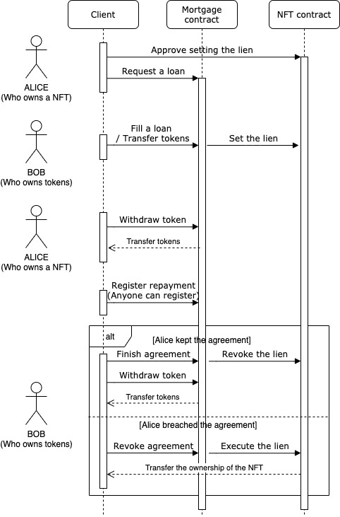
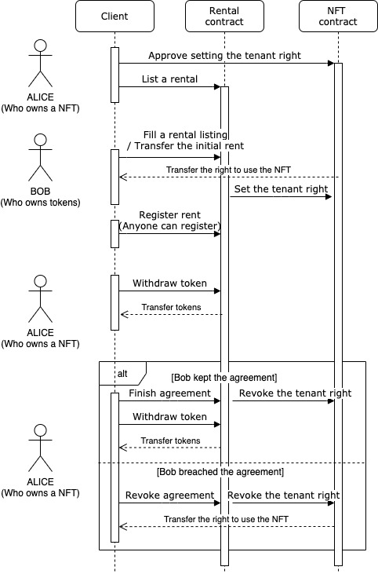

## Simple Summary

ERC2615 enables NFTs to support rental and mortgage functions. These functions are necessary for NFTs to work as assets, just like real estates in the real world.

## Abstract

This ERC is a modified version of ERC721. It proposes additional user classes, the right of tenants to enable rentals, the right of lien, and the existing user class owner. With ERC2615, NFT owners will be able to rent out their NFTs and take out a mortgage by collateralizing their NFTs. For example, this standard can apply to:

- Virtual items(gaming assets, virtual artworks)
- Physical items(houses, cars)
- Intellectual property rights
- DAO membership tokens

NFT developers are also able to integrate ERC2615 since it is fully backward compatible.
One notable point is that the person who has the right to use an application is not the owner but the user (tenant). Application developers must implement this specification into their applications.

## Motivation

There have been a variety of applications around ERC20 tokens, like DeFi ecosystems. DeFi ecosystems enable the token owners to enjoy various applications by leveraging the value of tokens. I intend to make ERC2615 to be a foundation of NFTs to have multiple applications like ERC20s.

With ERC721, it has been challenging to realize rentals and mortgages since ERC721 has only one user class of the owner.

For rentals, there has been a necessity of security deposit for trustless rent with ERC721. For mortgages, there has been a necessity of ownership lockup to the contract for trustless mortgages. ERC2615 eliminated those necessities of lockups by integrating the basic rights of tenant and lien. Also, by standardizing functions, application developers can incorporate those functions easily.

## Specification

ERC2615 consists of three user classes.
Like ERC721, there will be many IDs which represent unique items.
The right of each user class is summarized below.

| Types of right |          Lien           |          Owner          |     User      |
| -------------- | :---------------------: | :---------------------: | :-----------: |
| Their right    | Transfer owner and user | Transfer owner and user | Transfer user |

Application developers must serve the right to use their services to the address assigned to the user. Owner and lien are user classes that have the right to transfer ownership and user.

### ERC-2615 Interface

```solidity

  event TransferUser(address indexed from, address indexed to, uint256 indexed itemId, address operator);
  event ApprovalForUser(address indexed user, address indexed approved, uint256 itemId);
  event TransferOwner(address indexed from, address indexed to, uint256 indexed itemId, address operator);
  event ApprovalForOwner(address indexed owner, address indexed approved, uint256 itemId);
  event ApprovalForAll(address indexed owner, address indexed operator, bool approved);
  event LienApproval(address indexed to, uint256 indexed itemId);
  event TenantRightApproval(address indexed to, uint256 indexed itemId);
  event LienSet(address indexed to, uint256 indexed itemId, bool status);
  event TenantRightSet(address indexed to, uint256 indexed itemId,bool status);

  function balanceOfOwner(address owner) public view returns (uint256);
  function balanceOfUser(address user) public view returns (uint256);
  function userOf(uint256 itemId) public view returns (address);
  function ownerOf(uint256 itemId) public view returns (address);

  function safeTransferOwner(address from, address to, uint256 itemId) public;
  function safeTransferOwner(address from, address to, uint256 itemId, bytes memory data) public;
  function safeTransferUser(address from, address to, uint256 itemId) public;
  function safeTransferUser(address from, address to, uint256 itemId, bytes memory data) public;

  function approveForOwner(address to, uint256 itemId) public;
  function getApprovedForOwner(uint256 itemId) public view returns (address);
  function approveForUser(address to, uint256 itemId) public;
  function getApprovedForUser(uint256 itemId) public view returns (address);
  function setApprovalForAll(address operator, bool approved) public;
  function isApprovedForAll(address requester, address operator) public view returns (bool);

  function approveLien(address to, uint256 itemId) public;
  function getApprovedLien(uint256 itemId) public view returns (address);
  function setLien(uint256 itemId) public;
  function getCurrentLien(uint256 itemId) public view returns (address);
  function revokeLien(uint256 itemId) public;

  function approveTenantRight(address to, uint256 itemId) public;
  function getApprovedTenantRight(uint256 itemId) public view returns (address);
  function setTenantRight(uint256 itemId) public;
  function getCurrentTenantRight(uint256 itemId) public view returns (address);
  function revokeTenantRight(uint256 itemId) public;


```

### ERC-2615 Receiver

```solidity

  function onERCXReceived(address operator, address from, uint256 itemId, uint256 layer, bytes memory data) public returns(bytes4);

```

### ERC-2615 Extensions

Extensions are introduced to help developers to build and use their application more flexible and easier.

1.  ERC721 Compatible functions

This extension makes ERCX compatible with ERC721. By adding the following functions developers can take advantage of the existing tools for ERC721. Transfer functions in this extension transfer both Owner and User when tenant right has not been set(only ownership can be transferred when tenant right is set)

```solidity

  function balanceOf(address owner) public view returns (uint256)
  function ownerOf(uint256 itemId) public view returns (address)
  function approve(address to, uint256 itemId) public
  function getApproved(uint256 itemId) public view returns (address)
  function transferFrom(address from, address to, uint256 itemId) public
  function safeTransferFrom(address from, address to, uint256 itemId) public
  function safeTransferFrom(address from, address to, uint256 itemId, bytes memory data) pubic

```

2.  Enumerable

This extension is analogous to the enumerable extension of the ERC721 standard.

```solidity

  function totalNumberOfItems() public view returns (uint256);
  function itemOfOwnerByIndex(address owner, uint256 index, uint256 layer)public view returns (uint256 itemId);
  function itemByIndex(uint256 index) public view returns (uint256);

```

3.  Metadata

This extension is analogous to the metadata extension of the ERC721 standard.

```solidity

  function itemURI(uint256 itemId) public view returns (string memory);
  function name() external view returns (string memory);
  function symbol() external view returns (string memory);

```

## How rentals and mortgages work

ERC2615 token doesn’t deal with token/money transfer. Other applications must orchestrate money transfers and agreement validations to achieve rental and mortgage functions.

### Mortgage functions

The following diagram shows how mortgage function can be achieved.



Suppose that Alice is the person who owns NFTs and wants to take out a mortgage, and Bob is the person who wants to earn interest by lending tokens.

1. Alice approves setting the lien for the NFT.
2. Alice sends a loan request to the mortgage contract.
3. Bob fills a loan request, and the lien is set to the NFT by the mortgage contract
4. Alice can withdraw the borrowed tokens from the mortgage contract
5. Alice registers repayment (anyone can pay the repayment)
6. Bob can finish the agreement if the agreement span ends and the agreement is kept(repayment is paid without delay)
7. Bob can revoke the agreement if the agreement is breached (repayment is not paid until the due time) and execute the lien and take over the ownership of the NFT.

### Rental functions

The following diagram shows how rental functions work.



Suppose that Alice is the person who owns NFTs and wants to rent out a NFT, and Bob is the person who wants to lease a NFT.

1. Alice approves setting the tenant-right for the NFT.
2. Alice sends a rental listing to the rental contract.
3. Bob fills a rental request, and the right to use the NFT is transferred to Bob. At the same time, the tenant-right is set, and Alice becomes not able to transfer the right to use the NFT.
4. Bob registers rent (anyone can pay the rent)
5. Alice can withdraw the rent from the rental contract.

6. Alice can finish the agreement if the agreement span ends and the agreement is kept(rent is paid without delay)
7. Alice can revoke the agreement if the agreement is breached (rent is not paid until the due time) and revoke the tenant-right and take over the right to use the NFT.

## Rationale

There have been some attempts to achieve rentals or mortgages with ERC721. However, as I noted before, it has been challenging to achieve. I will explain the reasons and ERC2615’s advantages below.

### No security lockup for rentals

It has been necessary to deposit security funds to achieve trustless rental of NFTs with ERC721. Security deposits are required to prepare malicious activities from tenants. This is because It is impossible to take back the ownership once it is transferred to the other address. With ERC2615, there is no need to deposit security funds since the standard natively supports rental and those functions.

### No ownership escrow when taking out a mortgages

It has been necessary to deposit the NFTs to take out a mortgage by collateralizing NFTs. Security collateral for the mortgage is required to prepare the potential default risk of the mortgage.
However, security collateral with ERC721 hurts the utility of the NFT. This is because most applications serve their services to the address assigned to the owner of the NFT, and no one can use it when it’s locked to a contract.
With ERC2615, it is possible to collateralize NFTs and use them at the same time.

### Easy integration

Because of the above reasons, a great deal of effort is needed to integrate those functions into applications with ERC721. Adopting ERC2615 for the NFT standard is the easiest way to have rental and mortgage features.

### No money/token transactions within tokens

A NFT itself doesn't handle lending or rental functions directly. ERC2615 is open-source, and there is no platform lockup. Developers can integrate it without having to worry about those risks.

## Backwards Compatibility

As mentioned in the specifications section, ERC-N can be fully ERC721 compatible by adding an extension function set.
In addition to that, new functions introduced in ERC-N have many similarities to the existing functions in ERC721. Because of that, developers become able to learn and adopt a new standard quickly.

## Test Cases

when doing test, you need to use development network in Truffle.

```
ganache-cli -a 15  --gasLimit=0x1fffffffffffff -e 1000000000
```

```
truffle test -e development
```

Powered by Truffle and Openzeppelin test helper.

## Implementation

[the reposotory](https://github.com/kohshiba/ERC-X).

## Security Considerations

Since the external contract will control lien or tenant rights, flaws within the external contract directly lead to the standard's unexpected behavior.

## Copyright

Copyright and related rights waived via [CC0](https://creativecommons.org/publicdomain/zero/1.0/).
